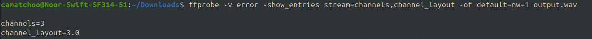
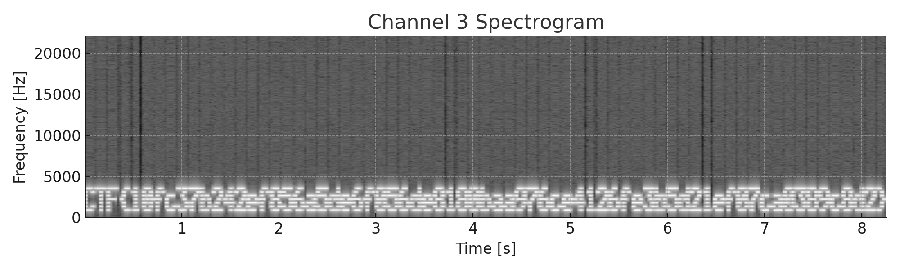

## Solution :

From the name of the channel 3rd child and the given audio we can deduce that it has something to do with third channels.  
And when checking with :

```
$ ffprobe -v error -show_entries stream=channels,channel_layout -of default=nw=1 output.wav

```



We can indeed verify the existance of 3 channels.  
Aftre splitting the audio and analyze we can find the flag in the spectogram.


