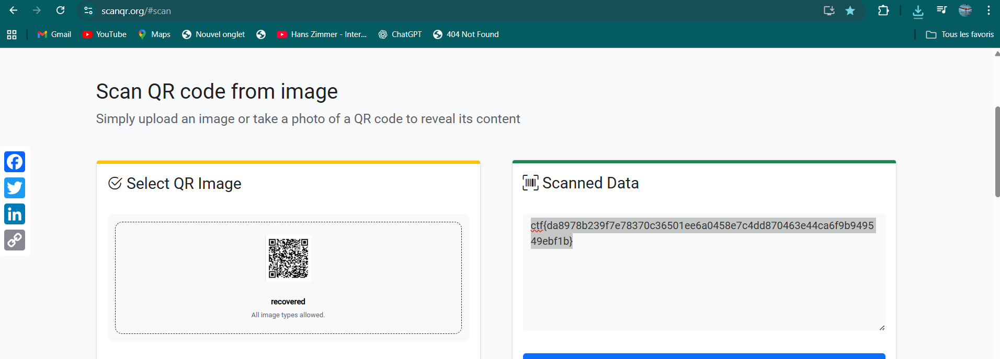

# Unknown Traffic 2 - CTF Writeup

## Challenge Information

- **Name**: Unknown Traffic 2
- **Category**: Forensics
- **Points**: 100
- **Author**: thek0der
- **Description**: A lot more traffic just showed up on the network. Can you figure out what it is?

## Solution Overview

This challenge involves analyzing network traffic to extract hidden data that forms a QR code containing the flag.

## Initial Analysis

### Step 1: Examine the PCAP file

First, let's analyze the provided network capture file:

```bash
file traffic.pcap
# Should show: tcpdump capture file (little-endian) - version 2.4
```

### Step 2: Look for interesting strings

Using `strings` to examine readable content in the PCAP:

```bash
strings traffic.pcap | head -20
```

This reveals patterns like `CHUNK_X:base64data` where X appears to be a sequence number.

## Data Extraction Process

### Step 3: Extract and sort the chunks

The key insight is that the data is split into numbered chunks that need to be reassembled in order:

```bash
# Extract lines containing CHUNK_ pattern
strings -n 6 traffic.pcap | grep '^CHUNK_'
```

This shows entries like:

```
CHUNK_1:iVBORw0KGgoAAAANSUhEUgAA...
CHUNK_2:qoAAAAIBAJ0Uk5TAP//////////...
CHUNK_3:8f/X/9//3//f/9//3//f/9//3/...
...
```

### Step 4: Sort chunks numerically and decode

The chunks need to be sorted by their sequence number, then the base64 data extracted and decoded:

```bash
# Complete extraction command
strings -n 6 traffic.pcap \
  | grep '^CHUNK_' \
  | sort -t_ -k2,2n \
  | cut -d: -f2 \
  | base64 -d > recovered.png
```

Let's break down this command:

- `strings -n 6 traffic.pcap`: Extract strings of minimum 6 characters
- `grep '^CHUNK_'`: Filter lines starting with "CHUNK\_"
- `sort -t_ -k2,2n`: Sort by the number after the underscore (numerical sort)
- `cut -d: -f2`: Extract everything after the colon (the base64 data)
- `base64 -d`: Decode the base64 data
- `> recovered.png`: Save to file

### Step 5: Verify the recovered file

```bash
file recovered.png
# Output: recovered.png: PNG image data, 680 x 680, 1-bit grayscale, non-interlaced
```

## QR Code Analysis

### Step 6: View the recovered image

The recovered PNG file contains a QR code. You can view it with any image viewer:

```bash
# Using various image viewers
eog recovered.png      # GNOME
feh recovered.png      # Lightweight
xdg-open recovered.png # Default system viewer
```


### Step 7: Decode the QR code

The QR code can be decoded using online tools or command-line utilities:

**Online method:**

- Upload the image to any QR code scanner website
- Example: scanqr.org, qr-code-generator.com, etc.



## Flag

```
ctf{da8978b239f7e78370c36501ee6a0458e7c4dd870463e44ca6f9b94549ebf1b}
```
