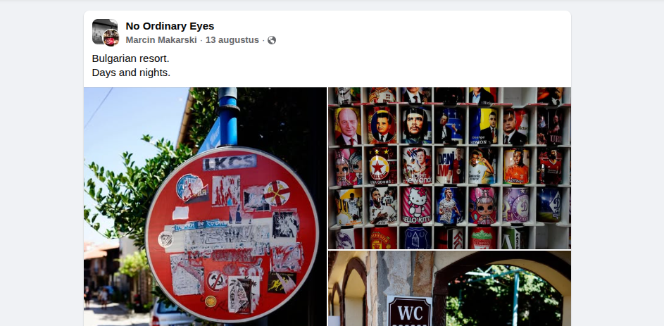
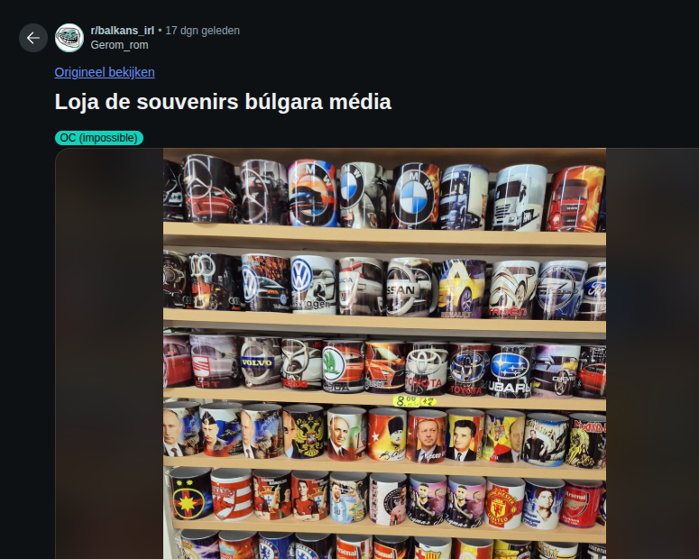

## Solution :

Strated by reverse searching the image using google lense, and I came across this blog about mugs in balchik, however after looking more into the beaches there I realised that its the wrong place.  
Then i cam across a reddit and a facebook posts with a picture of similair mugs and written next to it bulgaria,which allowed me to narrow it down to bulgaria.

After that kept trying to google dork ` beach shops bulgaria, mugs beach bulgaria` till i came across this youtube video about the golden sands beach : https://www.youtube.com/watch?v=yrUunWWjQJU tried it and it was the flag
