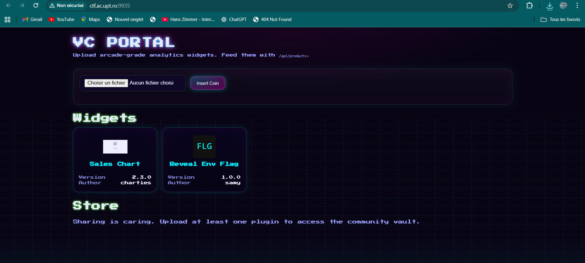
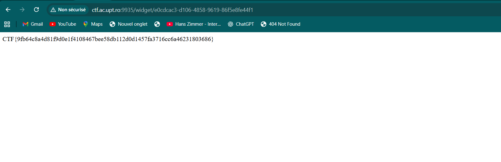

# VC Portal - Reveal Env Flag (Web)

**Challenge:** VC Portal  
**Category:** Web Security  
**Difficulty:** Medium  
**Flag:** `CTF{9fb64c8a4d81f9d0e1f4108467bee58db112d0d1457fa3716cc6a46231803686}`

## Overview

VC Portal is a web application that allows users to upload "arcade-grade analytics widgets" in the form of `.plugin` files. The challenge involves exploiting the plugin upload mechanism to achieve remote code execution and extract environment variables containing the flag.



## Challenge Analysis

### Initial Reconnaissance

The web application presents a cyberpunk-themed interface with:

- A file upload form accepting `.plugin` files
- A "Widgets" section displaying uploaded plugins
- A "Store" section (unlocked after uploading plugins)
- An API endpoint at `/api/products` providing sample data

### Code Analysis

Examining the provided `server.py` file reveals several critical security vulnerabilities:

```python
# Key vulnerability: Hardcoded AES key
KEY = b"SECRET_KEY!123456XXXXXXXXXXXXXXX"

def decrypt_file(input_path, output_path, key):
    with open(input_path, "rb") as f:
        data = f.read()
    iv = data[:16]
    ciphertext = data[16:]
    cipher = AES.new(key, AES.MODE_CBC, iv)
    plaintext = unpad(cipher.decrypt(ciphertext), AES.block_size)
    with open(output_path, "wb") as f:
        f.write(plaintext)
```

The upload process follows these steps:

1. Accept `.plugin` file uploads
2. Decrypt the file using a hardcoded AES key
3. Extract the decrypted ZIP archive
4. Read `plugin_manifest.json` for metadata
5. **Execute `init.py` without any sandboxing**
6. Serve the plugin content at `/widget/<uuid>`

### Critical Vulnerability

The most critical vulnerability is in the upload handler:

```python
try:
    log(f"executing_plugin uid={uid} path={init_py}")
    r = subprocess.run(["python","init.py"], cwd=plugin_dir, capture_output=True, text=True, timeout=30)
    global FLAG_ID
    FLAG_ID = uid
    log(f"plugin_stdout uid={uid} out={r.stdout.strip()}")
    log(f"plugin_stderr uid={uid} err={r.stderr.strip()}")
except Exception as e:
    log(f"exec_error uid={uid} err={e}")
```

The server executes arbitrary Python code from uploaded plugins without any security restrictions, leading to **Remote Code Execution (RCE)**.

## Exploitation

### Step 1: Understanding the Plugin Format

Plugins are encrypted ZIP files containing:

- `plugin_manifest.json` - Metadata about the plugin
- `init.py` - Python script executed on upload
- `index.html` - Web interface served to users
- Additional assets (images, CSS, etc.)

### Step 2: Analyzing the Pre-existing Plugin

The challenge includes a `reveal_envflag.plugin` file. When uploaded, this plugin:

1. Executes its `init.py` script on the server
2. Reads environment variables (including the flag)
3. Generates an `index.html` that displays the flag

### Step 3: Exploitation Process

1. **Upload the malicious plugin:**

   - Navigate to the VC Portal homepage
   - Click "Insert Coin"
   - Upload the `reveal_envflag.plugin` file

2. **Server-side execution:**

   - The server decrypts and extracts the plugin
   - Executes the `init.py` script with server privileges
   - The script reads environment variables and creates an HTML page

3. **Flag retrieval:**
   - A new widget card appears: "Reveal Env Flag"
   - Click on the widget to navigate to `/widget/<uuid>`
   - The generated page displays the flag directly



### Step 4: Flag Extraction

The flag is displayed on the widget page:

```
CTF{9fb64c8a4d81f9d0e1f4108467bee58db112d0d1457fa3716cc6a46231803686}
```

## Vulnerability Chain

1. **Hardcoded encryption key** - Allows anyone to create valid `.plugin` files
2. **Lack of code signing** - No verification of plugin authenticity
3. **Arbitrary code execution** - `init.py` runs with server privileges
4. **No sandboxing** - Full access to server environment and filesystem
5. **Environment variable exposure** - Sensitive data accessible to plugin code

## Alternative Exploitation Methods

Since we have RCE, other potential attacks include:

1. **File system access:**

```python
# Read server configuration files
with open('/etc/passwd', 'r') as f:
    content = f.read()
```

2. **Network reconnaissance:**

```python
import subprocess
result = subprocess.run(['netstat', '-an'], capture_output=True, text=True)
```

3. **Reverse shell:**

```python
import socket, subprocess, os
# Reverse shell payload
```
