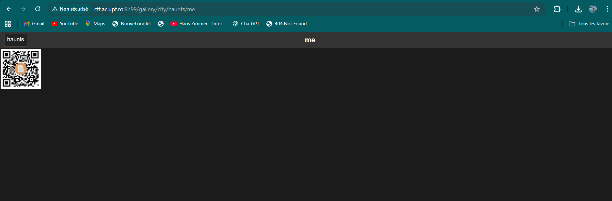

# Random Gallery - CTF Web Challenge Write-up

## Challenge Information

- **Name:** Random Gallery
- **Points:** 100
- **Category:** Web
- **Author:** RaduTek

## Initial Analysis

Le challenge nous présente une page de login à l'URL `ctf.ac.upt.ro:9799/login`. La page contient un formulaire de connexion basique avec des champs username et password.

## Reconnaissance and Directory Enumeration

After analyzing the login page, I proceeded with directory enumeration to discover potential hidden endpoints:

- `/admin` - Not accessible
- `/user` - Not accessible
- `/images` - Not accessible
- `/gallery` - **Accessible!**

## Login Bypass

By accessing `/gallery` directly, I was able to completely bypass the authentication system. This suggests that the application doesn't properly verify access permissions on certain routes.

**Discovered URL:** `ctf.ac.upt.ro:9799/gallery/`

## Gallery Exploration

The gallery page reveals a "Web Gallery" interface with several photo albums available:

- "animal" album
- "city" album


_Main gallery interface showing available albums_

While exploring these albums, I navigated to: `ctf.ac.upt.ro:9799/gallery/city/haunts/me`


_Album view with QR code containing sensitive information_

## QR Code Discovery

In the album, I found a QR code containing important information. The QR code was displayed as an image with a document icon in the center.


_QR code found in the photo album with document icon overlay_

## QR Code Decoding

Using an online QR scanner (scanqr.org), I was able to decode the QR code content which pointed to:


_QR code scanning process revealing the hidden URL_

**Revealed URL:** `https://pastebin.com/9HibccWH`

## Flag Retrieval

By visiting the Pastebin link, I found the following content:


_Pastebin page containing the final flag_

```
ctf{1cd4daf060aee882653595cca4e719d48a3080cd1b76055812145da8a10b47e1}
```

## Flag

**Flag :** `ctf{1cd4daf060aee882653595cca4e719d48a3080cd1b76055812145da8a10b47e1}`

## Identified Vulnerabilities

1. **Broken Access Control:** The system allows access to `/gallery` without authentication
2. **Information Disclosure:** Photo albums contain sensitive information (QR code with flag)
3. **Insufficient Authorization:** No permission verification on protected resources
